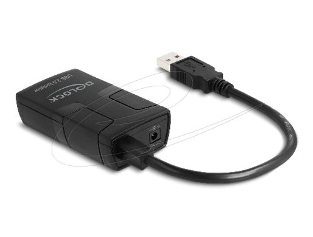
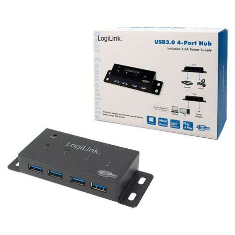

## Equipment List

| Instrument | Model | Quantity | Purpose | Picture |
| :--- | :--- | :---: | :--- | :---: |
| Potentiostat | EmStat4S HR | 4 | Electrochemistry| |
| Galvanic Isolator | Delock Isolator | 4 | Electrical isolation| |

| 4-Port Hub | LogiLink USB 3.0 4-Port Hub | 1 | Instrument connection| |
