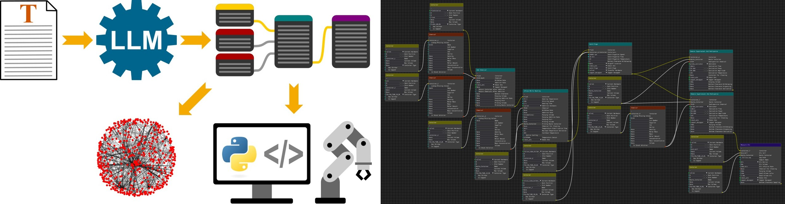

# MINERVA Workflow Generator



This repository contains files for the automated workflow and knowledge graph generation from unstructured natural language input with LLMs, as well as the Node Editor that can be used in the materials acceleration platform [MINERVA](https://github.com/BAMresearch/MAPz_at_BAM/tree/main/Minerva). It also contains some examples and links to further resources.

The fully trained LLM Models and the raw and cleaned datasets will be made available on [huggingface](https://huggingface.co/bruehle) and [Zenodo](https://zenodo.org/). 
- The datasets contain inputs (i.e., experimental procedures based on [this dataset](https://figshare.com/articles/dataset/Chemical_reactions_from_US_patents_1976-Sep2016_/5104873/1)) and annotated outputs (i.e., action graphs) used for training the LLMs.
- The models are fine-tuned LLMs based on [BigBirdPegasus](https://huggingface.co/google/bigbird-pegasus-large-bigpatent) and [LED-Base](https://huggingface.co/allenai/led-base-16384) for generating action graphs from experimental procedures. 

| **Note:** The files in this repository are part of an unpublished manuscript. Once accepted for publication, the files and links will be added here. In the meantime, only the documentation and some examples are available to give an impression of the features, scope, and usage of the software. | 
|-------------------------------------------------------------------------------------------------------------------------------------------------------------------------------------------------------------------------------------------------------------------------------------------------------|

## Video
A short video showing the node editor, the automatic workflow generation from natural language input, and the knowledge graph generation can be found [here](Documentation/Videos/Workflow-Generator_Example.mp4).


## Folder Structure
- **Documentation:** Additional resources used in this documentation
- **Examples:** Examples of Node Setups that can be opened with the Node Editor and a Jupyter Notebook demonstrating the use and querying of an action graph  
- **LLM_Scripts:** The scripts that were used for fine-tuning the LLM Models, running inference on the Llama Models, calculating metrics, and testing the performance 
- **Node_Editor:** Releases of the node editor for generating and editing workflows for [MINERVA](https://github.com/BAMresearch/MAPz_at_BAM/tree/main/Minerva), and exporting them as knowledge graphs or executable python code.

## Installation:
Clone (or download) the repository, set up a virtual environment, and install the packages from requirements.txt. The node editor also requires [MINERVA](https://github.com/BAMresearch/MAPz_at_BAM/tree/main/Minerva) to be installed (for installation instructions, see the linked repository).

Exemplary installation for Windows:
```commandline
git clone https://github.com/BAMresearch/MAPz_at_BAM
cd MAPz_at_BAM\Minerva-Workflow-Generator
python -m venv .\venv
.\venv\Scripts\activate
pip install -r requirements.txt
```
## How to use the LLMs:
The LLMs can be used for creating action graphs from experimental procedures written in natural language. When used from within the [node editor](#how-to-use-the-node-editor-for-creating-a-workflow), the action graphs will be turned directly into node graphs. To try and compare the different models "stand-alone", i.e., without the node editor, simply run the following code after [installing the dependencies](#installation):

```python
from transformers import pipeline, AutoModelForSeq2SeqLM, AutoTokenizer
import torch
import re


def preprocess(rawtext: str)->str:
    rawtext = rawtext.replace('( ', '(').replace(' )', ')').replace('[ ', '[').replace(' ]', ']').replace(' . ', '. ').replace(' , ', ', ').replace(' : ', ': ').replace(' ; ', '; ').replace('\r', ' ').replace('\n', ' ').replace('\t', '').replace('  ', ' ')
    rawtext = rawtext.replace('μ', 'u').replace('μ', 'u').replace('× ', 'x').replace('×', 'x')
    for m in re.finditer(r'[0-9]x\s[0-9]', rawtext):
        rawtext = rawtext.replace(m.group(), m.group().strip())
    return rawtext


if __name__ == '__main__':
    rawtext = """<Insert your Synthesis Procedure here>"""

    model_id = 'bruehle/BigBirdPegasus_Llama'  # or use any of the other models:
    # model_id = 'bruehle/LED-Base-16384_Llama'
    # model_id = 'bruehle/BigBirdPegasus_Chemtagger'
    # model_id = 'bruehle/LED-Base-16384_Chemtagger'
    
    if 'BigBirdPegasus' in model_id:
        max_length = 512
    elif 'LED-Base-16384' in model_id:
        max_length = 1024
    
    model = AutoModelForSeq2SeqLM.from_pretrained(model_id, device_map='auto')
    tokenizer = AutoTokenizer.from_pretrained(model_id, trust_remote_code=True)
    pipe = pipeline('text2text-generation', model=model, tokenizer=tokenizer)

    print(pipe(preprocess(rawtext), max_new_tokens=max_length, do_sample=False, temperature=None, top_p=None)[0]['generated_text'])
```

## How to use the Node Editor for creating a workflow:


### Basics
Most of the basic functionalities can be seen from the video shown [above](#video-showcase). The Node Editor has two views, the `Reaction Editor` for setting up nodes that describe the reaction, and the `Configuration Editor` for defining the hardware configuration of the system. Both (partially) influence each other, e.g., a container should be defined in the `Configuration Editor` and assigned to a `Sample Holder` hardware there, and then the same container node can be used in the `Reaction Editor`. To switch between views, click on the `View` menu in the menu bar and select the Node Editor you want to switch to.

### Adding/Removing and Linking/Unlinking Nodes
New Nodes can be added by right-clicking anywhere in the Node Editor and selecting the Node from the popup menu, or by selecting the nodes from the `Nodes` menu in the menu bar. Nodes can be linked by dragging the output from one node to the appropriate input field of another node (or vice versa) using the `Left Mouse Button`. Nodes can be deleted by selecting the node(s) and then pressing the `<DEL>` key. They can be unlinked (or re-linked to a different input field or node) by pressing the `<CTRL>` key and dragging the node link. 

### Navigation
Use the `Mouse Wheel` to zoom in or out and press the `Middle Mouse Button` for panning. Alternatively, you can Navigate by clicking/dragging on the `Minimap` in the bottom right corner.

### Viewing Options
Besides switching between the `Reaction Editor` and the `Configuration Editor`, the `View` menu in the menu bar can also be used for Collapsing/Expanding all nodes (same as pressing the `^` or `v` buttons on the nodes), toggling the display of images for hardware nodes in the `Configuration Editor`, and automatically arranging the nodes in the `Reaction Editor` in a grid pattern (currently not supported in the `Configuration Editor`). This can be helpful for making large/complex node setups more compact and easier to view and navigate.   

### Shortcuts
Most shortcuts have their expected default functionality. You can use `<CTRL>+C` for copying, `<CTRL>+V` for pasting, `<CTRL>+S` for saving, `<CTRL>+O` for opening, and `<CTRL>+E` for exporting the node setup as an executable python file. `<CTRL>+X` is used for exportng the current node setup as a hardware configuration rather than cutting, though.

### File Formats
Node  setups from the `Reaction Editor` are saved as `.rxn` files, while node setups from the `Configuration Editor` are saved as `.conf` files. Both are essentially just json files that contain information about the types, input fields, locations, and links of the nodes in a way that can be understood (and re-opened) by the Node Editor.

To export a hardware configuration that can be used by the [MINERVA](https://github.com/BAMresearch/MAPz_at_BAM/tree/main/Minerva) backend, please choose `File->Export->Export as Configuration...` from the menu bar (or press `<CTRL+X>`) and export the configuration as a `.json` file.

To export a workflow from node setup that can be run by the [MINERVA](https://github.com/BAMresearch/MAPz_at_BAM/tree/main/Minerva) backend, please choose `File->Export->Export as Python...` from the menu bar (or press `<CTRL+E>`) and save it as a `.py` file.

To generate a Knowledge Graph from the current `Reaction Node` setup, please choose `File->Export->Export as Knowledge Graph...`. This generates a `.csv` file containing the triplets `source`, `target`, `edge`,  separated by `<TAB>` (see also [here](#how-to-use-the-generated-knowledge-graphs) for more information how to use these files). 

### Automatic Workflow Generation using LLMs 
**Please Note:** Depending on your Hardware and the LLM Model you selected, this process can take some time (up to a few minutes).

To automatically generate a workflow from syntheses procedures in natural language, please select `File->Create from Natural Language...`, paste the synthesis description into the text field, select the LLM Model you want to use from the dropdown list, and press `OK`.

## How to use the generated Knowledge Graphs:


The exported .csv files contain all relations as tab-separated values in the order `source`, `target`, `edge`. An excerpt from an example is given below (the full full example can be found [here](Examples/Knowledge_Graph.csv)):

| source                                          | target            | edge          |
|-------------------------------------------------|-------------------|---------------|
| Container-Reaction_Flask_50_mL                  | current hardware  | has_property  |
| Container-Reaction_Flask_50_mL-current hardware | flaskstation      | has_value     |
| Container-Reaction_Flask_50_mL                  | deck position     | has_property  |
| ...                                             | ...               | ...           |
| concentration                                   | Quantity          | is_a          |
| stirring_speed                                  | float             | is_a          |
| slot_number                                     | int               | is_a          |

A jupyter notebook that demonstrates how the knowledge graphs can be visualized and queried from the .csv files with [networkx](https://networkx.org/documentation/stable/index.html) and [pyplot](https://matplotlib.org/stable/tutorials/pyplot.html) can be found [here](Examples/Knowledge_Graphs.ipynb).