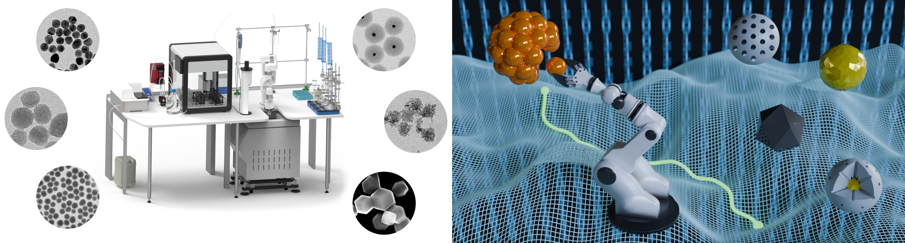

# MINERVA



This repository contains files for the hardware and software used in the materials acceleration platform MINERVA:

**M**AP for\
**I**ntelligent\
**N**anomaterial synthesis\
**E**nabled by\
**R**obotics for\
**V**ersatile\
**A**pplications.

It also serves as the documentation, and gives several examples on how to use the software as well as more insights and implementation details for various features that are supported.

| **Note:** The files in this repository are part of a publication that is currently under review. Once accepted for publication, they will be added here. In the meantime, only the documentation and examples are available to give an impression of the features and usage of the platform. | 
|----------------------------------------------------------------------------------------------------------------------------------------------------------------------------------------------------------------------------------------------------------------------------------------------|

## Video Showcase
A short video showing the MAP in action and featuring some exemplary synthesis, purification, and characterization steps can be found [here](Documentation/Videos/MINERVA_Showcase.mp4).

https://github.com/user-attachments/assets/51650673-b5de-43ec-b29e-ba39b8661c8e

## Folder Structure
- **3D_Printed_Parts:** .sdl files for 3D printing all parts for the custom-built hardware used in this project
- **API:** Essential files for MINERVA-OS including the task scheduler and all abstract base classes and metaclasses used in inheritance, as well as the API for communicating with the hardware through high-level commands
- **Arduino_Code:** Arduino code for the custom-built hardware used in this project
- **Configuration:** Folder for saving hardware configuration files
- **Documentation:** Additional resources used in this documentation
- **Hardware:** Folder and Subfolders for the low level communication with all [implemented hardware devices](#Hardware-that-is-currently-implemented)
- **Logs:** Folder for saving log files
- **OT2_Custom_Labware:** Folder for saving hardware definition files for custom hardware that is used with the Opentrons OT2 pipetting robot
- **OT2_Protocols:** Folder for saving automatically generated OT2 protocl files
- **SampleHolder:** Folder for saving sample holder definition files
- **Software:** Folder with additional [Software plugins](#Software-that-is-currently-implemented) for MINERVA-OS
- **Synthesis Scripts:** Folder for saving Python synthesis scripts that are run on the hardware

## Hardware that is currently implemented:
- Opentrons OT2 Pipetting Robot
- UFactory XArm 6 Robotic Arm
- Herolab RobotCen
- Hielscher Probe Sonicator
- Bandelin Bath Sonicator
- Ika RCT Digital Hotplates
- WPI Aladdin Syringe Pumps
- Malvern Panalytical Zetasizer Ultra Red
- Molecular Devices Spectramax M3
- Vici Valco Valve Actuator
- DHT22 Sensor (controlled by an Arduino - custom-built)
- Multiport Valve Actuator (controlled by an Arduino - custom-built)
- Emergency Stop Button (controlled by an Arduino - custom-built)
- Capper/Decapper (controlled by an Arduino - custom-built)
- Hotplate Clamps (controlled by an Arduino - custom-built)
- Hotplate Fans (controlled by an Arduino - custom-built)

## Software that is currently implemented:
- MINERVA-OS for workflow orchestration, including:
  - High Level API as an abstraction layer for low level hardware commands and automatic book-keeping
  - Helpers comprising a collection of Abstract Base Classes, Metaclasses, Enums, Datatypes, etc.
  - [Task Scheduler](#Task-Scheduler) for parallelizing tasks (based on a priority queue)
  - Many built-in heuristics, unit conversion, etc.
- ELN Integration with OpenBIS
- Machine learning algorithms for closed-loop optimization (beta)

## Installation:
Clone the repository, set up a virtual environment, install the packages from requirements.txt, and create a .pth file in the site-packages directory of the virtual environment (or add the directory to `PYTHONPATH` environment variable to make it available outside of the virtual environment). For Windows:
```commandline
git clone ...
cd Minerva
python -m venv .\venv
pip install -r requirements.txt
pip install -r requirements_ML.txt
cd ..
cd > .\Minerva\venv\Lib\site-packages\minerva.pth
```

## How to use:
The low and mid level commands for hardware communication are defined in the repsective python files in the `Hardware` folder and its subfolders, however, most users will probably only interact with them through the high-level `MinervaAPI`.

The high level API contains several convenience methods and helper classes that should make it very simple for the user to interact with the hardware in the context of chemical synthesis. The main functionality includes the following classes:
- `Container`: A container instance is anything that can hold a chemical, e.g., a round-bottom flask, or a Falcon tube. Pretty much all high-level functions such as `add`, `heat`, `centrifuge`, etc. are called on a container instance.
- `Chemical`: A Chemical instance is a defined amount of a reagent or reactant that is used in a reaction or for cleaning and that can be added to a container

Generally, the book-keeping is done with instance variables of each class, which means that e.g. the current volume of a liquid in a container, the position of a container in a sample holder, or the position of the next available tip rack and pipette tip for the OT2 will be "remembered". The current configuration and the properties of all objects can be serialized and saved as a json file (it is also auto-saved on exit), and fully restored/deserialized from the file.

## Examples:
In the following, some basic examples of how the high level API can be used are given. The [first example](#example-1-continue-from-a-saved-configuration) shows how to continue from a previously saved configuration, the [second example](#example-2-start-from-scratch) shows how to start from scratch.

## Example 1: Continue from a saved configuration

If you have already saved a configuration from a previous run and simply want to continue, all you need are the following 4 lines of code to carry out a synthesis:

```python
from MinervaAPI import *

if __name__ == '__main__':
    # Load previous configuration
    MinervaAPI.Configuration.load_configuration('./Example_Config.json')

    MinervaAPI.Configuration.Containers['reactionFlask'].add_chemical(
        [c for c in MinervaAPI.Configuration.Chemicals.values()])
    MinervaAPI.Configuration.Containers['reactionFlask'].heat(heating_temperature='80 C', stirring_speed=300, heating_time='10 s')
    MinervaAPI.Configuration.Containers['reactionFlask'].move(MinervaAPI.Configuration.SampleHolder['corkRing1'])
```

This will add all the `Chemical`s which were previously defined (EtOH, TEOS, Ammonia, CTAB in the example) to a previously defined `Container` called `reactionFlask`, heat the Flask at 80 °C for 10 seconds while stirring at 300 rpm, and then put it on a previously defined "sample holder" named `corkRing1`.

The names such as `reactionFlask` and `corkRing1` can be chosen by the user when creating the configuration (or can be automatically inferred from variable names). After loading the configuration, a summary of all loaded Objects is also displayed, e.g.:

```
Configuration:
==============
Addition Hardware:
	ot2                    : OT2@169.254.64.133
	syringe_pump           : Aladdin@COM14
Sample Holder:
	holder1                : SampleHolder->deck 1
	holder2                : SampleHolder->deck 2
	corkRing1              : SampleHolder->deck 3
	ot2Holder1             : SampleHolder at OT2@169.254.64.133->deck 1
	ot2Holder2             : SampleHolder at OT2@169.254.64.133->deck 2
	ot2Holder3             : SampleHolder at OT2@169.254.64.133->deck 3
	labsolute1000uLTipRack : SampleHolder at OT2@169.254.64.133->deck 11
Sonicators:
	bathSonicator          : SonorexDigitecHRC@COM15
Containers:
	reactionFlask          : FLASK_50_ML: 4.2106 mL at SampleHolder->deck 3->slot 1
	EtOHContainer          : FALCON_TUBE_50_ML: 49.0 mL at OT2@169.254.64.133->slot 9
	CTABContainer          : FALCON_TUBE_50_ML: 47.8046 mL at OT2@169.254.64.133->slot 7
	NH4OHContainer         : FALCON_TUBE_15_ML: 14.4323 mL at OT2@169.254.64.133->slot 1
	TEOSContainer          : FALCON_TUBE_15_ML: 14.5524 mL at OT2@169.254.64.133->slot 4
Chemicals:
	EtOH                   : Chemical Ethanol (CAS:64-17-5): 1.0 mL; 0.0171 mol
	CTAB                   : Chemical CTAB (CAS:57-09-0): 1.0977 mL; 5.488e-04 mol
	Ammonia                : Chemical Ammonia (CAS:7664-41-7): 0.5677 mL; 0.01 mol
	TEOS                   : Chemical TEOS (CAS:78-10-4): 0.4476 mL; 2.0 mmol
```

Note: The high-level commands called on the `reactionFlask` object (`add_chemical`, `heat`, `move`) take care of all the complex low-level tasks. Under the hood, the following steps will be carried out by the API:

- Query the `reaction_flask` container and the `EtOH`, `CTAB`, `Ammonia`, and `TEOS` container
- Figure out that it will need the `OT2` for the addition step
- Instruct the robot arm to move the `reaction_flask` container from its current slot in its current sample holder (`cork_ring1`) to the next available slot in the first available sample holder in the `OT2` that is suitable for the `reactionFlask` container (which will be `ot2_holder3` - note how this does not need to be specified explicitly in the `add_chemical` step but is inferred automatically)
- Write the necessary python code for the `OT2`, taking the solvent levels in the containers during pipetting and the position of the next pipette tip into account, as well as automatically deciding which pipette to use for which addition step, potentially splitting the total volume into several aspirate/dispense cycles
- Run the python code it has written on the `OT2` to add all the chemicals and wait for it to finish
- Move the container from the `OT2` to a hotplate with a suitable heating block (in this example it will be `hotplate1Holder` on `hotPlate1`, but again, this does not need to be specified explicitly)
- Set the temperature of the hotplate to 80°C, the stirring speed to 300 rpm, and heat it for 10 seconds
- After that, the heating and stirring will be switched off automatically, and the robot arm will be instructed to move the `reactionFlask` back to `corkRing1`

## Example 2: Start from scratch

### 1. Initialize Hardware
When not resuming from a previously saved configuration, you usually want to start off with importing the available hardware that you plan to use, e.g.:

```python
# Define and initialize hardware
robotArm = UFactory.XArm6(ip_address='192.168.1.204')
ot2 = OpentronsOT2.OT2(robot_ip_address='OT2CEP20210918R04.local')
centrifuge = Herolab.RobotCen(com_port='COM8', initialize_rotor=True, home_rotor=True)
valve1 = SwitchingValve.SwitchingValve(com_port='COM10')
probeSonicator = UP200ST.UP200ST(ip_address='192.168.233.233')
bathSonicator = SonorexDigitecHRC.SonorexDigitecHRC(com_port='COM15')
hotPlate1 = RCTDigital5.RCTDigital5(com_port='COM11')
hotPlate2 = RCTDigital5.RCTDigital5(com_port='COM4')
hotPlate3 = RCTDigital5.RCTDigital5(com_port='COM6')
hotPlate4 = RCTDigital5.RCTDigital5(com_port='COM16')
syringe_pump = Aladdin.Aladdin(com_port='COM14')
```

### 2. Define avaialable Sample Holder
The next step would be to define all the sample holders that are available, specify where they can be found with the `deck_position` argument, and potentially point to their `parent_hardware` defined above:
	
```python
# Define Holders that are available
holder1 = SampleHolder.SampleHolder(SampleHolder.SampleHolderDefinitions.Isolab_50mL_Foldable_Tube_Rack, deck_position=1)
holder2 = SampleHolder.SampleHolder(SampleHolder.SampleHolderDefinitions.Isolab_15mL_Foldable_Tube_Rack, deck_position=2)
corkRing1 = SampleHolder.SampleHolder(SampleHolder.SampleHolderDefinitions.Corkring_Small, deck_position=3)
ot2Holder1 = SampleHolder.SampleHolder(SampleHolder.SampleHolderDefinitions.Opentrons_50mL_Tube_Rack, parent_hardware=ot2, deck_position=1)
ot2Holder2 = SampleHolder.SampleHolder(SampleHolder.SampleHolderDefinitions.Opentrons_15mL_Tube_Rack, parent_hardware=ot2, deck_position=2)
ot2Holder3 = SampleHolder.SampleHolder(SampleHolder.SampleHolderDefinitions.Opentrons_50mL_Flask_Rack, parent_hardware=ot2, deck_position=3)
hotplate1Holder = SampleHolder.SampleHolder(SampleHolderDefinitions.Ika_50mL_Heating_Block, parent_hardware=hotPlate1, deck_position=1)
hotplate2Holder = SampleHolder.SampleHolder(SampleHolderDefinitions.Ika_50mL_Heating_Block, parent_hardware=hotPlate2, deck_position=2)
hotplate3Holder = SampleHolder.SampleHolder(SampleHolderDefinitions.Ika_50mL_Heating_Block, parent_hardware=hotPlate3, deck_position=3)
hotplate4Holder = SampleHolder.SampleHolder(SampleHolderDefinitions.Ika_50mL_Heating_Block, parent_hardware=hotPlate4, deck_position=4)
```

### 3. Define avaialable Container
Next, you can define the containers that are in the different holders:
	
```python
reactionFlask = Container(current_hardware=corkRing1, slot_number=1, name='Reaction Flask', max_volume=Volume(50, 'mL'), container_type=ContainerTypeCollection.FLASK_50_ML)

WasteContainer = Container(current_hardware=valve1, deck_position=0, name='Waste_Container', max_volume=Volume(5, 'L'))
AirForPurging = Container(current_hardware=valve1, deck_position=1, name='Air')
EtOHForWashingContainer = Container(current_hardware=valve1, deck_position=2, name='EtOH_Canister', current_volume=Volume(5, 'L'))
AcetoneForWashingContainer = Container(current_hardware=valve1, deck_position=3, name='Acetone_Canister', current_volume=Volume(5, 'L'))
WaterForWashingContainer = Container(current_hardware=valve1, deck_position=4, name='Water_Canister', current_volume=Volume(5, 'L'))

EtOHContainer = Container(current_hardware=ot2, deck_position=8, slot_number=9, name='EtOH_Container', current_volume=Volume(50, 'mL'), container_type=ContainerTypeCollection.FALCON_TUBE_50_ML)
CTABContainer = Container(current_hardware=ot2, deck_position=8, slot_number=7, name='CTAB_Container', current_volume=Volume(50, 'mL'), container_type=ContainerTypeCollection.FALCON_TUBE_50_ML)
NH4OHContainer = Container(current_hardware=ot2, deck_position=8, slot_number=1, name='NH4OH_Container', current_volume=Volume(15, 'mL'), container_type=ContainerTypeCollection.FALCON_TUBE_15_ML)
TEOSContainer = Container(current_hardware=ot2, deck_position=8, slot_number=4, name='TEOS_Container', current_volume=Volume(15, 'mL'), container_type=ContainerTypeCollection.FALCON_TUBE_15_ML)
```
	
There are a couple of things to note here. First, notice how `current_hardware`	is defined diffrently in different cases. Most commonly, `current_hardware` will actually be one of the sample holder defined above, such as in `current_hardware=cork_ring1` or `current_hardware=ot2_holder2`. Only in cases where the hardware does not have any holders at all, or where you do not need the robot arm to interact with the containers, you can set it to the actual hardware itself, such as `current_hardware=ot2` or `current_hardware=valve1`

Also, even though some parameters such as `current_volume`, `max_volume` or `container_type` are technically optional for object creation, they are required by a number of methods and should be set in almost all cases. Lastly, the values for `deck_position` needs to be defined here if it is not already defined for the `parent_hardware`.

### 3.a Working with Quantities
We also made use of a `Quantity` named `Volume` by setting `current_volume=Volume(50, 'mL')`. You could also instantiate it from a string, i.e., `current_volume=Volume.from_string('50 mL')`, or just pass the string directly to the constructor of the `Container`, i.e., `current_volume='50 mL'`, and the API will instanciate it for you. Finally, there are often several synonyms for a unit, so the following are all equivalent:
	
```python
v1 = Volume(50, 'mL')
v2 = Volume(50, 'ccm')
v3 = Volume(50, 'milliliter')
v4 = Volume(50, 'mils')
```
	
Also, the quantities support basic arithmetics and comparisons, hence the following expression works and evaluates to `True`
	
```python
Volume(50, 'mL') + Volume(5000, 'uL') + Volume(1, 'L') / 2 < Volume(5, 'L')
```
	
This also allows to give quantities in the most convenient unit, for example the `Volume` calculated from the quantities `MolarAmount(5, 'mmol')`, `Density(970, 'kg/m3')`, and `MolarMass(208.33, 'g/mol')` when creating a `Chemical` will still be correct, even though different units are used for all quantities (see also the [example in the next paragraph](#4-define-chemicals)).

### 4. Define Chemicals
Once the `Container`s are defined, we can create our chemicals. There is a lot of flexibility here, you can either instantiate them from scratch (mostly used if you want to add something only one time) or from a stock solution (if you are using additions of the same chemical over and over again, e.g., for washing solutions). You can also specify the amount to be added in various ways. Currently, only liquid handling is supported, so ultimately the API will convert everything to a `Volume`, but for convenience you can also specify molar amounts along with molar mass and density, a mass along with a mass concentration, a molar amount and molar concentration, etc. (basically any combinaton that allows to calculate a volume from the given quantities).
	
```python
# Stock chemicals
EtOHForWashing_Stock = Chemical(container=EtOHForWashingContainer, name='Ethanol for washing', is_stock_solution=True)
AcetoneForWashing_Stock = Chemical(container=AcetoneForWashingContainer, name='Acetone for washing', is_stock_solution=True)
WaterForWashing_Stock = Chemical(container=WaterForWashingContainer, name='Water for washing', is_stock_solution=True)

# Washing solutions (showing how to instantiate them from stock solutions)
EtOHForWashing = Chemical.from_stock_chemical(stock_chemical=EtOHForWashing_Stock, volume=Volume(50, 'mL'))
AcetoneForWashing = Chemical.from_stock_chemical(stock_chemical=AcetoneForWashing_Stock, volume=Volume(50, 'mL'))
WaterForWashing = Chemical.from_stock_chemical(stock_chemical=WaterForWashing_Stock, volume=Volume(50, 'mL'))

# Reagents (showing how to instantiate them from scratch)
EtOH = Chemical(container=EtOHContainer, name='Ethanol', volume=Volume(5, 'mL'))
CTAB = Chemical(container=CTABContainer, name='CTAB', concentration=Concentration(500, 'mM'), mass=Mass(200, 'mg'))
Ammonia = Chemical(container=NH4OHContainer, name='Ammonia', molar_amount=MolarAmount(0.01, 'mol'), mass_concentration=MassConcentration(300, 'g/L'))
TEOS = Chemical(container=TEOSContainer, name='TEOS', cas='78-10-4', molar_amount=MolarAmount(2, 'mmol'))
```
	
Notice how only `EtOHForWashing`, `AcetoneForWashing`, `WaterForWashing`, and `EtOH` are defined with a volume directly. For `CTAB` (a solid), the concentration of the solution (in mol/L) is given, together with the mass of that chemical that you would weigh out when adding the solid directly. For `TEOS`, just the amount in mol is given. In the first case, the API will attempt to look up the chemical on PubChem or Wikidata, get its molar mass, and calculate the required volume from the given values. Similarly, in the second case, the API will attempt to look up the density and molar mass of TEOS and calculate the required volume from these values. This does of course require an internet connection. If the data cannot be found online, if your PC is not connected to the internet, or if you want more control over the value that is used, you can of course also provide the values yourself.
	
```python
TEOS = Chemical(container=TEOSContainer, name='TEOS', cas='78-10-4', molar_amount=MolarAmount(2, 'mmol'), density=Density(0.94, 'g/ccm'), molar_mass=MolarMass(208.33, 'g/mol'), lookup_missing_values=False)
```

Setting `lookup_missing_values=False` is not required here, but will speed things up.

### 5. Define Hardware Configuration
Finally, we have to tell the `OT2` and the `Valve` their configuration:
	
```python
# Tell the hardware where to find which chemical/container/sample holder
OT2Configuration = {
	1: ot2Holder1,
	2: ot2Holder2,
	3: ot2Holder3,
	4: None,
	5: None,
	6: None,
	7: None,
	8: 'opentrons_10_tuberack_falcon_4x50ml_6x15ml_conical',
	9: None,
	10: 'opentrons_96_tiprack_20ul',
	11: 'opentrons_96_tiprack_1000ul',
	12: 'p1000_single_gen2',  # left pipette
	13: 'p20_single_gen2',  # right pipette
}

ValveConfiguration = {
	0: WasteContainer,
	1: AirForPurging,
	2: EtOHForWashingContainer,
	3: AcetoneForWashingContainer,
	4: WaterForWashingContainer,
	5: 'Outlet',
	6: syringe_pump
}

ot2.set_hardware_configuration(OT2Configuration)
valve1.set_configuration(ValveConfiguration)
```

Notice how you can either use a `SampleHolder` instance (`ot2_holder1`, `ot2_holder2`, `ot2_holder3`) or a String describing the `OT2` hardware (`'opentrons_10_tuberack_falcon_4x50ml_6x15ml_conical'`, `'opentrons_96_tiprack_20ul'`, `'p1000_single_gen2'`) when creating the `OT2` configuration. The `OT2` deck number (the first number in the configuration) __has to__ be the same as the `holder_number` specified when creating the `Container` instances. For the valve, the number specified in the configuration and the `holder_number` specified when the `Container` instance is created have to be the same and correspond to the port of the valve to which the `Container` is physically connected.

### 6. Run the Reaction
With everything set up, running the reaction is now as easy as calling

```python
# Run the reaction

# Add all the chemicals to the flask
reactionFlask.add_chemical([EtOH, CTAB, Ammonia, TEOS], robotArm)

# Put the flask on the hotplate and heat the mixture under stirring
reactionFlask.heat(heating_temperature='80 C', stirring_speed=300, heating_time='10 s')

# Put the flask back on the cork ring
reactionFlask.move('corkRing1')
```

These are essentially the same steps from [Example 1](#example-1-continue-from-a-saved-configuration) above, and the same steps will be carried out under the hood as described [there](#example-1-continue-from-a-saved-configuration).

### 7. Save the configuration
You can now manually save the configuration to a file by using

```python
# Save the configuration
MinervaAPI.Configuration.save_configuration(configuration_file_path='./Configuration/Example_Config.json', update_name_mappings=True)
```

In fact, that is exactly how the 'Example_Config.json' for [Example1](#example-1-continue-from-a-saved-configuration) was created. The configuration will also be saved automatically to './Configuration/last_config.json' when the program exits (to disable this for the current session, run `MinervaAPI.Configuration.disable_autosave_on_exit()`).

The parameter `update_name_mappings=True` will ensure that the objects have "meaningful" names (even though you never had to explicitly specify names for them) by using the variable names from the `vars()` in `__main__` as object names. This way, the object that is currently adressed through the variable `reactionFlask` will still be called `reactionFlask` when loading the configuration, and it can be accessed via `MinervaAPI.Configuration.Containers['reactionFlask']`, as shown in [Example 1](#example-1-continue-from-a-saved-configuration). You could even use "late binding" to restore the variables and objects after loading the new configuration in a completely new session:

```python
import sys
from MinervaAPI import *

# Load the configuration
MinervaAPI.Configuration.load_configuration('./Configuration/Example_Config.json')

# Bind everything to your current namespace using the previously defined names
for _, i in MinervaAPI.Configuration:
	sys.modules['__main__'].__dict__.update(i)

# Now you can refer to the variable `reactionFlask` again as before, without ever having created it yourself:
print(reactionFlask.current_volume)
reactionFlask.add_chemical([EtOH, CTAB, Ammonia, TEOS], robotArm)
```

However, manipulating the `__dict__` property in such a way is probably __not a good idea__, use at your own risk.

## Task Scheduler

The task scheduler is an abstract class with only static methods, defined in `HelperClassDefinitions`. It is used to parallelize task execution, while at the same time keeping certain tasks grouped together, and ensuring that tasks belonging to the same reaction run sequentially (mostly - there are a few exceptions, see below). After all, it would not make much sense to heat a flask before adding the reactants just because the hotplate is currently free but the addition hardware is not.

The Task Scheduler is based on a producer-consumer design schema.

Classes that inherit from the `Hardware` abstract base class will automatically register with the Task Scheduler through a call to `register_object()` from the `__post_init__` method. When registering, each Hardware is assigned a Priority Queue, and a Consumer Thread is started for this Hardware. In this Consumer Thread, items that were added to the Priority Queue of the Hardware will be processed.

A [TaskGroupSynchronizationObject (tgso)](#task-group-synchronization-object-tgso) is used to ensure that tasks that are grouped together are executed together, while a sync condition that is part of the `tgso` is used to ensure sequential execution of tasks from the same group.

Generally speaking, a Hardware that was requested to perform a specific task as part of a task group will enter a waiting state where it waits until all required Hardware for this task group becomes available. There is also a mechanism for checking if the hardware that is in a waiting state for a task group that has not started yet is also required in another task group, and if so, it can leave and join the other task group. This is necessary to prevent deadlocks. The notification between task groups whenever hardware changes their state (enters or leaves task groups, finishes tasks, etc.) is done via a `notify_all()` call to `task_scheduler_global_event`.

The Task Scheduler also has a wrapper method called `@TaskScheduler.scheduled_task` that can be used as a decorator to signal that a method should be managed by the task scheduler. Please be aware of the following:
- This wrapper should usually only be used for the lowest-level methods. Calling a wrapped method from within another wrapped method results in a recursion that causes the program to freeze.
- The signature of the decorated method should include the following keyword arguments to control the behavior of the task scheduler:
  - `block`: Whether to wait for the result of this call or return a reference to a queue.Queue object that will hold the result and can later be used for resynchronization/callback. In most cases this should probably be set to `True`.  
  - `is_sequential_task`: If set to `True`, this task will only start after the currently running task from the same task group has finished. Likewise, the next sequential task from the same task group will also wait for this task to finish first. This is the intended behavior in most cases. Setting it to `False` is only required if several tasks from the __same__ task group still need to happen simultaneously (e.g., in `infuse_while_heating` where a chemical is added to a flask while the hotplate is heating/stirring the same flask). In these cases, the "outer" task(s) usually also need to be called in a non-blocking way. 
  - `priority`: Priority of this task. A lower number means a higher priority. 
  - `task_group_synchronization_object`: An object holding items that are used to keep tasks across different hardware grouped together and synchronized in the task scheduler.

### Task Group Synchronization Object (tgso)
These are dataclasses that hold the most important thread-safe objects needed by the task scheduler for grouping and synchronizing tasks, indicating which hardware performed its final task and can be released from the task group to join another one, whether a task group is currently active, and which of the required hardware components are ready to start processing the current task group. 

```python
@dataclass
class TaskGroupSynchronizationObject:
    sync_condition: threading.Condition
    is_final_task: Dict[Hardware, threading.Event]
    is_currently_active: threading.Event
    is_ready: Dict[Hardware, threading.Event]
```

#### Parameters

For sequential tasks, the `sync_condition` is acquired and held until the called method returns (for non-sequential tasks, the `sync_condition` is not acquired and the method is executed right away).

The Dictionary `is_final_task` holds an event for each hardware that is currently part of the task group, indicating whether the hardware performed its final task (for now) and can be released from this task group. The hardware can join the same task group at a later point. The entries are created automatically whenever a hardware is requested to join the tgso.

The Event `is_currently_active` is set once all required hardware that was needed to start the task group is available, and the task group started executing. "Waiting" hardware will never leave an active task group unless it is explicitly released by setting its `is_final_task` flag.

The Dictionary `is_ready` holds an Event for each hardware that indicates whether this hardware is ready to join the current task group.  The entries are created automatically whenever a hardware is requested to join the tgso.

#### Internal vs. External TaskGroupSynchronizationObjects

If no _external_ tgso is passed to a method that is wrapped with the `TaskScheduler.scheduled_task` decorator (the `task_group_synchronization_object` parameter is set to `None` or not specified), it will automatically create its own _internal_ tgso for book keeping. It will then pass this tgso on to any method it calls during its execution as an _external_ tgso (meaning the called methods won't create their own tgso). While some of the hardware might still join (and be released!) in methods that obtain an _external_ tgso, the Container locks will only be acquired and released from the class with the _internal_ tgso. This was done since currently all "high level" methods are called on the `Container` class, so a container should only be released once all tasks/methods operating on this container have finished. At the end  (in a `finally` statement), when the method that created the _internal_ tgso exits, all hardware and container locks are released, and the tgso is marked as completed (`is_currently_active` is cleared, the `is_final_task` flag is set for all hardware, and all hardware that might still be in the waiting list is released). Of course, the user can also create their own tgso and pass it to a method. In that case, the tgso will be _external_ for all methods, and the user needs to take care of releasing hardware and container locks themselves.   
